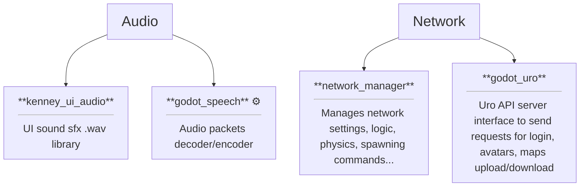
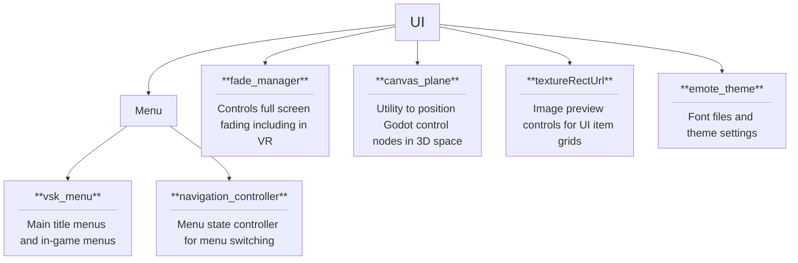
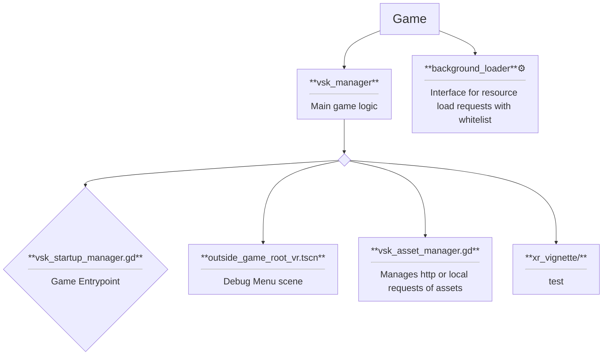
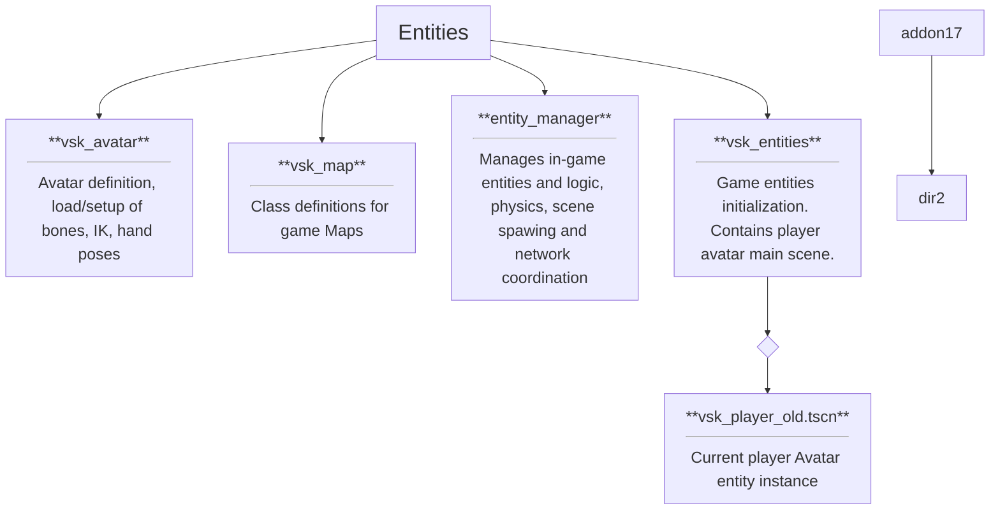
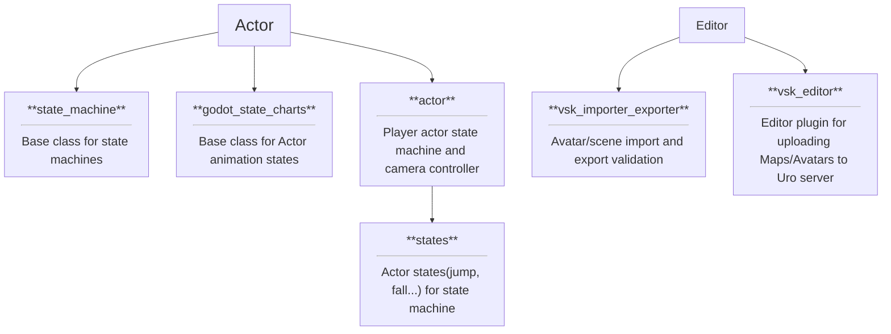
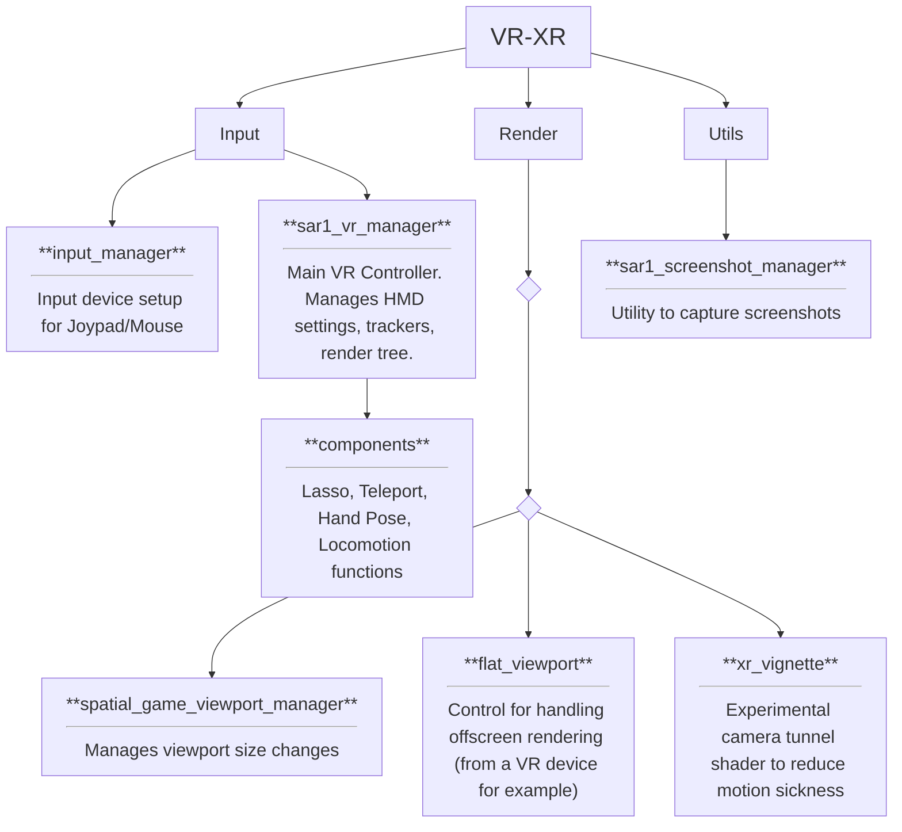
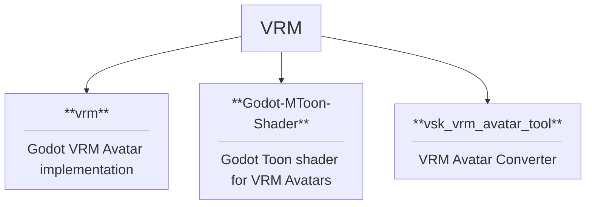
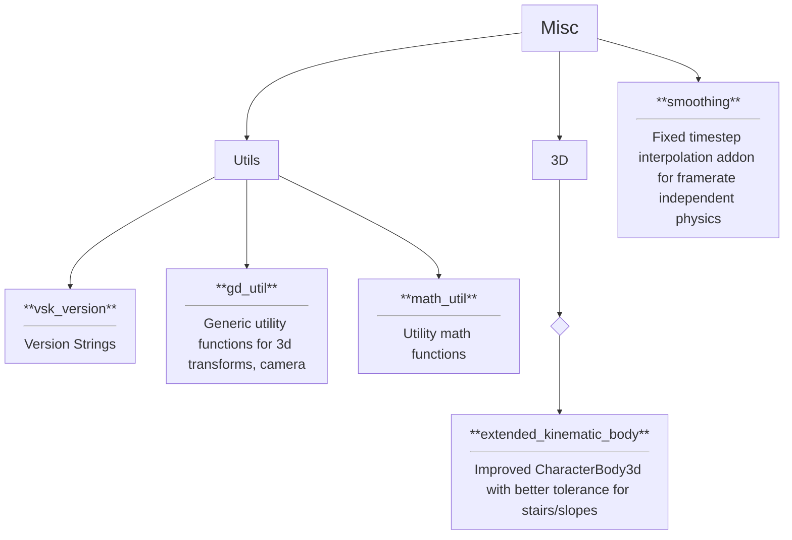

<h1 align="center">V-Sekai GDScript</h1>

Map of `addon/` components.
- :gear: Engine C++ Interface
- :warning: Unused (See also [Warnings](#warnings))

## Warnings

### vsk_entities/vsk_player.tscn
Unused code is also in addons/vsk_entities/extensions.

### smoothing
Deprecated by native lerp, needs replacing. See https://github.com/godotengine/godot-docs/pull/10197
